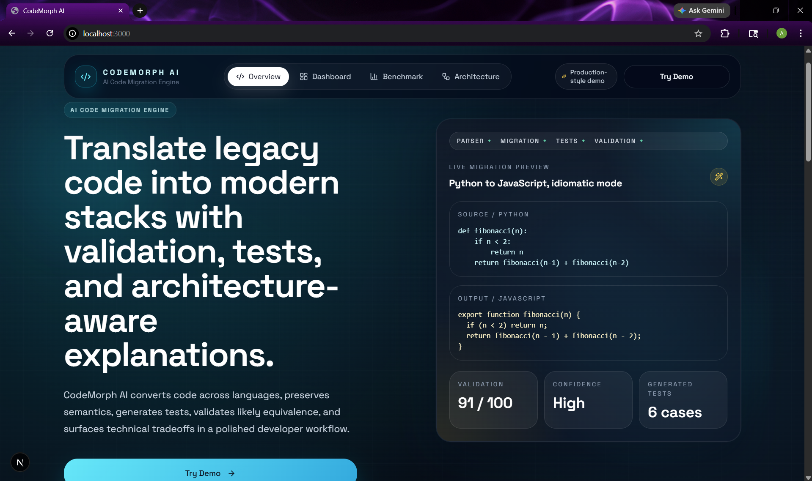
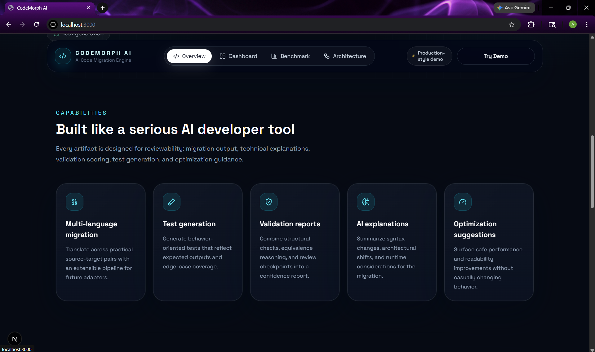
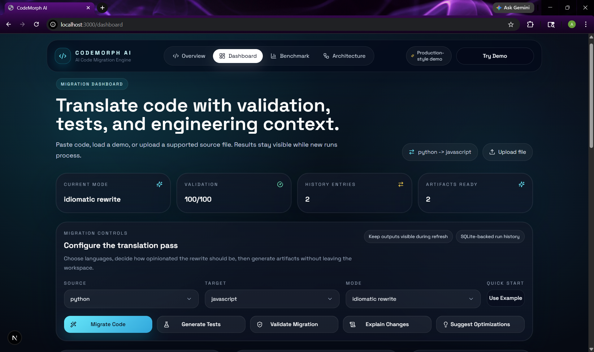
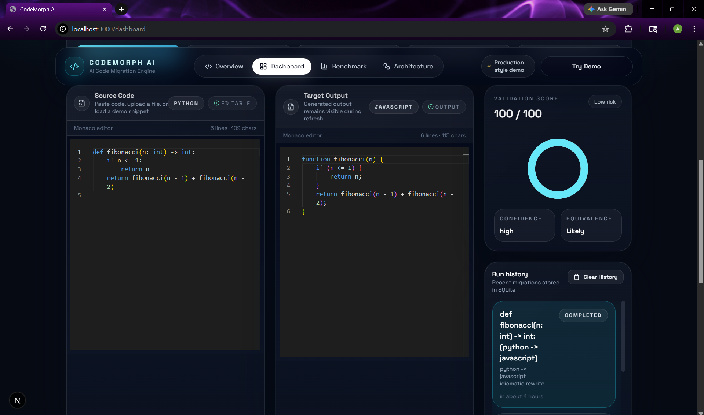
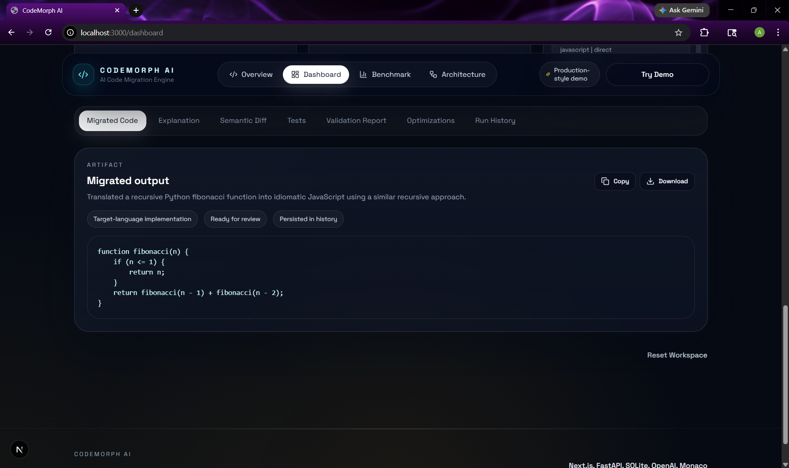
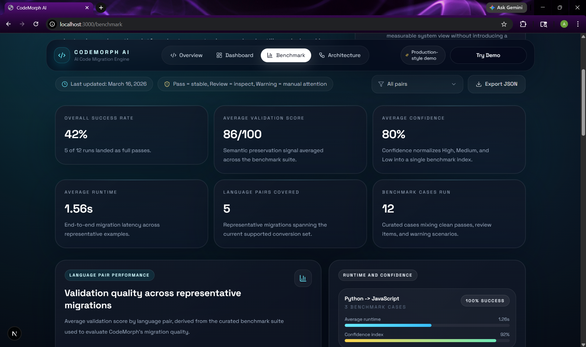
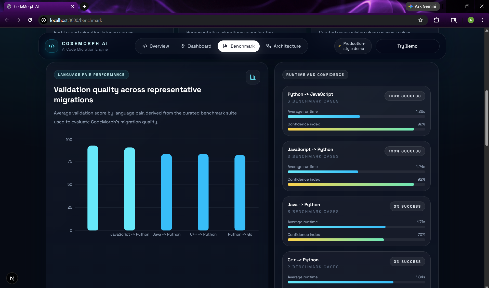
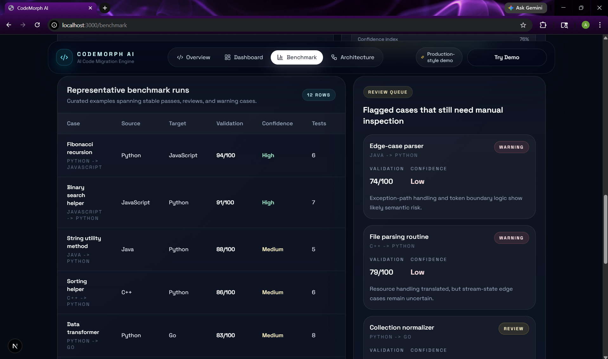
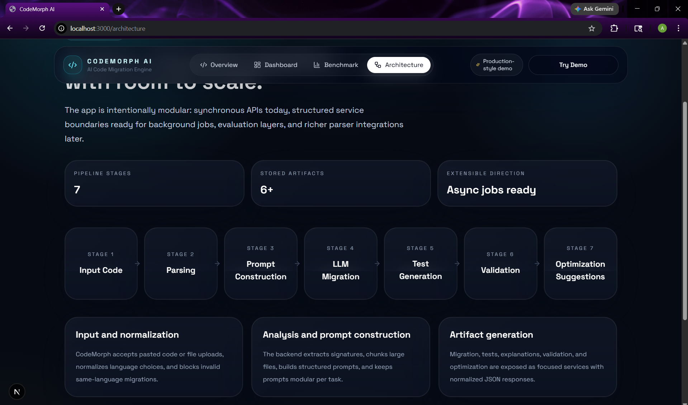

# CodeMorph AI - Architecture-Aware Code Migration Platform

CodeMorph AI is an architecture-aware code migration platform that translates legacy code across programming languages while preserving semantics, control flow, and system structure.



## Overview

Modern engineering teams inherit large codebases that outlive the language, framework, or runtime decisions they were originally built on. Migrating those systems is expensive because syntax translation alone is not enough: behavior, edge cases, structural intent, and architectural boundaries all need to survive the move.

CodeMorph AI approaches migration as a multi-stage engineering workflow rather than a single prompt. The platform parses source code, constructs structured prompts, generates idiomatic target-language output, synthesizes tests, evaluates likely semantic equivalence, and surfaces review risks through a full-stack product interface.

The project is designed to demonstrate production-minded software engineering around AI systems: modular backend services, typed API contracts, evaluation artifacts, benchmark reporting, persistent run history, and a polished frontend for interactive review.

## Problem

Cross-language code migration is difficult because a correct result must preserve more than surface syntax. Differences in typing, nullability, control flow, standard libraries, module systems, and runtime behavior can introduce subtle regressions. Manual migration is slow, expensive, and hard to validate at scale.

## Solution

CodeMorph AI treats migration as a structured pipeline:

1. Normalize and inspect the source code.
2. Extract lightweight structural signals.
3. Build task-specific prompts for migration, explanation, validation, tests, and optimization.
4. Generate structured LLM outputs for each artifact.
5. Validate the migration with structural comparison and model-assisted reasoning.
6. Persist artifacts for traceability, review, and benchmarking.

## Key Features

- Multi-stage migration pipeline with dedicated prompt builders per task
- Source parsing, chunking, and language normalization before prompt submission
- Structured migration outputs with summaries, notes, and semantic diffs
- Semantic validation with confidence, review points, and risk reporting
- Automated unit test synthesis for migrated code
- Side-by-side source and target code comparison in a polished web UI
- Run history backed by SQLite for traceability and review
- Benchmark / evaluation dashboard across representative migration cases
- OpenAI-backed generation with deterministic fallbacks for local demo use

## Architecture

### Frontend

The frontend is a Next.js App Router application built with TypeScript, Tailwind CSS, Framer Motion, Monaco Editor, and Recharts. It handles the landing page, migration dashboard, result visualization, run history inspection, architecture walkthrough, and benchmark dashboard.

### Backend

The backend is a FastAPI service with modular API routes, prompt builders, typed schemas, SQLAlchemy models, and SQLite persistence. It exposes endpoints for migration, explanation, test generation, validation, optimization, run history, and health checks.

### LLM Orchestration Layer

The LLM layer is isolated behind a reusable OpenAI service. Migration, validation, explanation, tests, and optimization each have their own prompt builder so the system can evolve stage-by-stage instead of relying on one monolithic prompt.

### Validation Layer

Validation combines lightweight structural extraction, signature-aware comparison, and model-generated review signals. The goal is not to claim formal equivalence, but to provide a practical engineering confidence layer for migration review.

### Evaluation Layer

The repository includes benchmark artifacts and a dedicated `/benchmark` product surface that summarize system-level performance across representative language-pair cases, including passes, review cases, runtime, confidence, and validation quality.

## Tech Stack

### Frontend

- Next.js 15
- React 19
- TypeScript
- Tailwind CSS
- Framer Motion
- Monaco Editor
- Recharts
- Lucide React

### Backend

- FastAPI
- Python 3.11
- SQLAlchemy
- Pydantic
- OpenAI Python SDK
- SQLite
- tree-sitter

### Tooling

- Vitest
- Pytest
- Docker
- docker-compose

## Repository Structure

```text
CodeMorphAI/
  backend/                 FastAPI service, prompts, persistence, tests
  frontend/                Next.js application and UI components
  docs/                    Architecture, API, and evaluation documentation
  evaluation/              Benchmark datasets, scripts, and result artifacts
  examples/                Sample inputs, outputs, and migration walkthroughs
  docker-compose.yml       Local full-stack dev orchestration
  README.md
  LICENSE
```

Important paths:

- `backend/app/api/v1/` - REST endpoints
- `backend/app/services/` - migration, history, seed, and OpenAI integration
- `backend/app/prompts/` - task-specific prompt builders
- `backend/app/utils/` - parsing, chunking, language inference, validation helpers
- `frontend/app/` - pages and routes
- `frontend/components/` - reusable UI surfaces
- `frontend/lib/` - API client, demo data, benchmark data, shared helpers
- `evaluation/results/` - benchmark summaries for repo review
- `examples/sample_migrations/` - quick walkthrough artifacts

## Setup Instructions

### Prerequisites

- Node.js 20+
- Python 3.11+
- npm
- pip

### Backend Setup

```powershell
cd backend
python -m venv .venv
.\.venv\Scripts\activate
python -m pip install -r requirements.txt
Copy-Item .env.example .env
```

Populate `backend/.env` with:

- `OPENAI_API_KEY`
- `OPENAI_MODEL`
- `DATABASE_URL`
- `CORS_ORIGINS`
- `APP_ENV`

### Frontend Setup

```powershell
cd frontend
cmd /c npm install
Copy-Item .env.example .env.local
```

Populate `frontend/.env.local` with:

- `NEXT_PUBLIC_API_BASE_URL=http://localhost:8000`

## Running the Application

### Backend

```powershell
cd backend
.\.venv\Scripts\activate
python -m uvicorn app.main:app --reload --host 0.0.0.0 --port 8000
```

### Frontend

```powershell
cd frontend
cmd /c npm run dev
```

### Full Stack with Docker

```powershell
docker-compose up --build
```

Frontend:

- `http://localhost:3000`

Backend:

- `http://localhost:8000`

## API Overview

### `POST /api/migrate`

Generate migrated target-language code, a migration summary, semantic diff, and notes.

### `POST /api/generate-tests`

Generate behavior-oriented test code and a test strategy for migrated output.

### `POST /api/validate`

Return validation score, confidence, detected risks, edge cases, and review recommendations.

### `POST /api/explain`

Generate a technical explanation of migration choices, syntax changes, and runtime considerations.

### `POST /api/optimize`

Suggest behavior-preserving improvements and complexity notes for migrated output.

### `GET /api/history`

Fetch recent migration runs from SQLite.

### `GET /api/history/{run_id}`

Fetch one persisted run and its stored artifacts.

### `GET /api/health`

Simple backend health check.

See [docs/api.md](docs/api.md) for request / response examples.

## Evaluation

CodeMorph AI includes a lightweight benchmark layer built around representative migration cases rather than a heavyweight offline evaluation engine. The evaluation artifacts summarize:

- language-pair coverage
- validation quality
- confidence distribution
- runtime characteristics
- review / warning cases that still need manual inspection

The benchmark surface inside the app is intentionally honest: it includes both strong cases and examples that still require review. Repo-level evaluation artifacts live under `evaluation/`.

See [docs/evaluation.md](docs/evaluation.md) for methodology details.

## Example Workflow

1. Paste or upload source code in the dashboard.
2. Choose source language, target language, and migration mode.
3. Generate the migrated code artifact.
4. Generate tests and semantic explanation.
5. Run validation to inspect confidence, edge cases, and manual review points.
6. Compare artifacts side-by-side and inspect historical runs.

## Engineering Decisions

### Why FastAPI

FastAPI provides a clean typed API surface, good ergonomics for request / response schemas, and a practical backend foundation for synchronous workflows that can later evolve into queued jobs.

### Why Structured Outputs

Each migration task returns a shaped JSON artifact instead of unstructured text. This keeps the frontend predictable and makes post-processing, persistence, and evaluation easier.

### Why Semantic Validation

Code migration systems are only useful if engineers can judge trustworthiness. A validation layer gives the system an explicit confidence and risk surface instead of forcing users to inspect raw generated code alone.

### Why a Modular Pipeline

Migration, tests, explanation, validation, and optimization are intentionally separate. That keeps the system extensible, easier to debug, and more representative of a real AI engineering workflow.

## Testing

### Backend

```powershell
cd backend
python -m pytest
```

### Frontend

```powershell
cd frontend
cmd /c npm run lint
cmd /c npm run test
```

## Screenshots / Demo

The repository is set up to display screenshots from `docs/screenshots/`.

### Landing Page

Hero overview and capability section.




### Migration Dashboard

Dashboard overview, editor workspace, and generated artifact review.





### Benchmark / Evaluation

System-level benchmark metrics, performance visualizations, and flagged review cases.





### Architecture Page

Pipeline stages and platform design overview.



## Future Improvements

- Add queued background execution for large or multi-file migrations
- Add repository-level migration flows instead of single-file input only
- Execute generated tests in language-specific sandboxes
- Expand benchmark coverage and automate benchmark export generation
- Add richer parser adapters and signature extraction
- Add authenticated team workspaces and artifact sharing

## Additional Documentation

- [Architecture notes](docs/architecture.md)
- [API documentation](docs/api.md)
- [Evaluation methodology](docs/evaluation.md)
