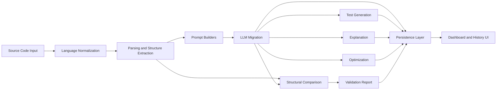

# Architecture

## System Overview

CodeMorph AI is organized as a full-stack AI developer tool with a React/Next.js frontend and a FastAPI backend. The system is designed around discrete artifact stages rather than a single opaque generation call.

## Frontend Responsibilities

- Provide the landing page, migration dashboard, benchmark page, architecture page, and history view
- Collect source input, language configuration, and migration mode
- Render generated artifacts in a code-review-friendly interface
- Visualize benchmark aggregates and representative evaluation cases
- Keep previous results visible during loading and preserve traceability via run history

## Backend Responsibilities

- Expose task-specific API routes for migration, tests, validation, explanation, optimization, and history
- Normalize language selections and infer languages when source input is omitted
- Extract lightweight source structure for prompt context and validation
- Persist migration artifacts in SQLite for later review
- Orchestrate OpenAI-backed structured generation with deterministic fallback behavior

## Prompt Orchestration

Each artifact has a dedicated prompt builder:

- `migration.py`
- `tests.py`
- `validate.py`
- `explain.py`
- `optimize.py`

This keeps the system maintainable and makes it easier to evolve one stage without destabilizing the rest of the product.

## Validation Layer

Validation is intentionally pragmatic rather than formal. It combines:

- structural extraction
- signature and shape comparison
- model-generated equivalence reasoning
- explicit risk and manual-review outputs

The goal is to give engineers a useful trust signal rather than a binary correctness claim.

## Evaluation Layer

The benchmark feature is a lightweight product-facing evaluation layer. It is built on seeded representative cases rather than a heavyweight offline harness, which keeps the system understandable while still signaling evaluation maturity.
